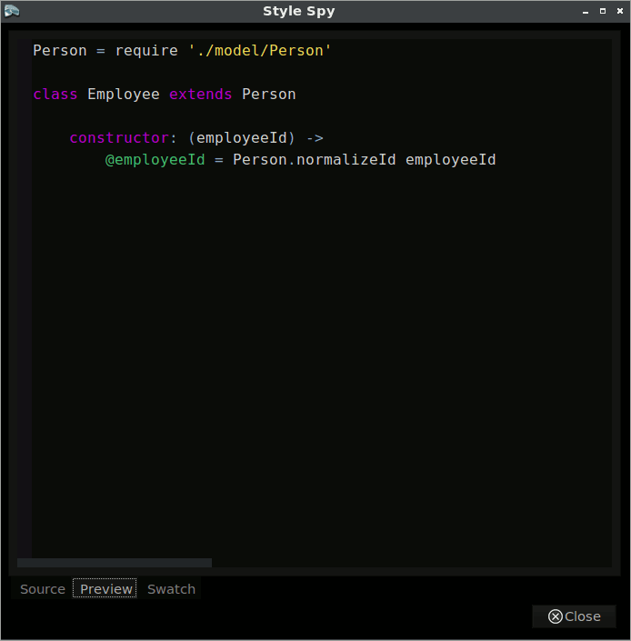

###The Basics
Style Spy is an extension for [Komodo IDE](http://komodoide.com/) and [Komodo Edit](http://komodoide.com/komodo-edit/).
It simplifies debugging and prototyping styles used in the Komodo editor.

###Installation
The extension XPI is available at https://ervumlens.github.io/ko-stylespy .

Once installed, the extension adds a new `Style Spy` menu under the main `Tools` menu.

###Usage

The best place to learn about Style Spy is in Style Spy itself.
Open the `Help` item under the `Tools` &rarr; `Style Spy` menu to read about functionality.

Here is a brief animation showing Style Spy in use.

###Build

Building Style Spy requires the [CoffeeScript](http://coffeescript.org) compiler available from the environment `PATH` and an installation of Komodo Edit or IDE.
The [`ko-stylespy`](https://github.com/ervumlens/ko-stylespy) repository includes Komodo macros that build the extension.
Just clone the repo, open a new Komodo project from within the `ko-stylespy` directory, and run the macros from the Komodo toolbox.

###Questions? Problems? Suggestions?

Report bugs, make enhancement requests, or ask questions at https://github.com/ervumlens/ko-stylespy/issues . Just click on the big "New Issue" button.

###Thank Yous

Thanks to Komodo Edit's developers and contributors, past and present, for making an editor that's enjoyable to use.

Thanks to Jeremy Ashkenas for creating CoffeeScript.
